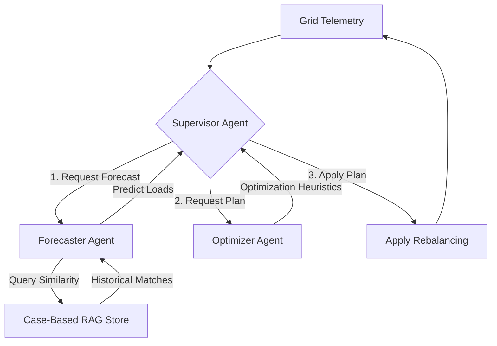

# Autonomous Energy Grid Balancer (AEGB)

An intelligent multi-agent system designed to optimize electrical grid stability by predicting load demand and dynamically rebalancing energy distribution. 

This project simulates a smart power grid and utilizes the **Supervisor Pattern** orchestrated via **LangGraph** to coordinate grid telemetry monitoring, load forecasting, and battery/generation optimization in real-time.

---

## 🏗️ Architecture

AEGB uses a modular, agentic architecture orchestrated via **LangGraph**:



### 1. Supervisor Agent (`grid_balancer/agents/supervisor.py`)
- Acts as the central operator of the grid control room.
- Evaluates the current state, grid frequency, and agent conversation log.
- Dynamically routes control to the **Forecaster** (when predictions are needed), the **Optimizer** (when rebalancing is required), or ends the cycle (`__end__`) when a stable balancing plan has been formulated.

### 2. Forecaster Agent (`grid_balancer/agents/forecaster.py`)
- Responsible for anticipating next-hour load and variable generation.
- Queries the **RAG Store** for historical cases that resemble the current time, temperature, and weather.
- Combines the historical averages with current deviations (e.g. extreme temperatures scaling air conditioning demand) to output a detailed demand and solar/wind generation forecast.

### 3. Optimizer Agent (`grid_balancer/agents/optimizer.py`)
- Translates forecasts and telemetry into control commands.
- Implements prioritized rule-based control heuristics:
  - **Deficit Rebalancing**: Ramps up clean fossil generation $\rightarrow$ discharges battery storage $\rightarrow$ triggers industrial load-shedding $\rightarrow$ triggers residential load-shedding (last resort).
  - **Surplus Rebalancing**: Charges battery storage $\rightarrow$ ramps down fossil generation $\rightarrow$ curtails variable solar and wind generation.
- Returns a list of power adjustments to apply to each node to bring the grid frequency back to a stable **50.0 Hz**.

---

## 🗄️ Case-Based RAG Store (`rag_store.py`)

To ensure this project is **100% free**, **fully offline**, and **compatible with Python 3.14+**, it implements a custom **Structured Case-Based Reasoning RAG store** instead of relying on heavy third-party vector databases (like `chromadb`) and paid embedding APIs.

It computes similarities using a weighted multi-attribute distance metric:
- **Hour Difference (Cyclic)**: Measures difference between hours using a wrap-around formula (so 23:00 and 00:00 are close).
  $$\text{dist}_{\text{hour}} = \min(|h_1 - h_2|, 24 - |h_1 - h_2|)$$
- **Temperature Deviation**: Absolute difference in degrees Celsius.
- **Weather Match**: Penalty multiplier if the weather category (e.g. sunny, stormy, cloudy) does not match.

The RAG store queries the top- $k$ most similar historical scenarios from a local file (`historical_rag_data.json`) to provide real data contexts to the Forecaster agent.

---

## ⚡ Grid Simulator (`grid_balancer/simulator.py`)

Models a utility-scale electrical grid with 6 nodes:
1. **Solar_Farm_A** (Variable generator, max 100MW)
2. **Wind_Farm_B** (Variable generator, max 80MW)
3. **Residential_Area_C** (Variable load, max 120MW)
4. **Industrial_Zone_D** (Variable load, max 150MW)
5. **Fossil_Fuel_Plant_E** (Dispatchable generator, max 150MW, min stable 10MW)
6. **Battery_Storage_F** (Storage node, max 200MWh capacity, 60MW max charging/discharging power)

### Grid Frequency Simulation
Grid frequency is modeled dynamically. Supply-demand imbalances cause frequency deviations from the ideal **50.0 Hz**:
- Excess demand drops frequency (turbines slow down under load).
- Excess supply increases frequency (turbines spin up).
- **Shutdown boundaries**: Grid collapses (blackout) if frequency slips below 45Hz or above 55Hz.

---

## 🚀 Setup & Execution

### Prerequisites
- Python 3.8+ (Compatible with Python 3.14.2)
- Pip package manager

### 1. Install Dependencies
Install the required lightweight dependencies:
```bash
pip install -r requirements.txt
```

### 2. Run the Simulation
Execute the main file to run a 12-hour simulation cycle simulating morning start-ups, midday solar peaks, hot afternoon demand surges, and evening storms:
```bash
python main.py
```

---

## 📊 Example Output Trace

When you run `main.py`, you will see a detailed log trace of the multi-agent system executing:

```
>>> TIME STEP 7/12: 14:00 | TEMP: 34.0°C | WEATHER: SUNNY
======================================================================
 TELEMETRY BEFORE REBALANCING 
======================================================================
 Status:        CRITICAL        | Frequency:    48.92 Hz
 Generation:    125.0 MW        | Demand:       234.0 MW
 Net Imbalance: -109.0 MW
----------------------------------------------------------------------
 Nodes Detail:
  - Solar_Farm_A         (solar)                :   95.0 / 100.0 MW
  - Wind_Farm_B          (wind)                 :   30.0 / 80.0 MW
  - Residential_Area_C   (residential_consumer) : -114.0 / 120.0 MW
  - Industrial_Zone_D    (industrial_consumer)  : -120.0 / 150.0 MW
  - Fossil_Fuel_Plant_E  (fossil_generation)    :   30.0 / 150.0 MW
  - Battery_Storage_F    (battery)              :    0.0 / 200.0 MW | SoC: 50% (100.0 MWh)
======================================================================
=== MULTI-AGENT REBALANCING WORKFLOW ACTIVATED ===

[Supervisor Agent]: Supervisor Analysis at Hour 14:00 | Temperature: 34.0°C | Weather: sunny | Frequency: 48.92Hz (Status: CRITICAL)
-> Telemetry received. Grid frequency is 48.92Hz. Historical RAG data is required to forecast load patterns for the next hour. Delegating to Forecaster Agent.

[Forecaster Agent]: Forecaster prediction for next-hour based on RAG cases: ['Hot Summer Midday Peak' (Hour 13, Temp 36.0°C, Weather 'sunny') | 'Hot Summer Evening Peak' (Hour 20, Temp 32.0°C, Weather 'cloudy')]:
  - Predicted Solar Output: 47.5 MW
  - Predicted Wind Output: 11.0 MW
  - Predicted Residential Demand: 124.2 MW
  - Predicted Industrial Demand: 107.5 MW
  - Predicted Total Demand: 231.7 MW | Predicted Base Generation: 88.5 MW
  - Net Predicted Imbalance before optimization: -143.2 MW (Deficit of 143.2 MW)

[Supervisor Agent]: Supervisor Analysis at Hour 14:00 | Temperature: 34.0°C | Weather: sunny | Frequency: 48.92Hz (Status: CRITICAL)
-> Forecast received (Predicted Gen: 88.5MW, Predicted Demand: 231.7MW). Control heuristics must be applied to balance power outputs and stabilize frequency. Delegating to Optimizer Agent.

[Optimizer Agent]: Optimizer finalized balancing recommendations:
  - Summary: Ramped up Fossil Fuel Plant by +120.0 MW (Output: 150.0/150.0 MW); Discharged battery by +23.2 MW (SoC: 38.4%)
  - Remaining Unbalanced Load: 0.0 MW

[Supervisor Agent]: Supervisor Analysis at Hour 14:00 | Temperature: 34.0°C | Weather: sunny | Frequency: 48.92Hz (Status: CRITICAL)
-> Rebalancing plan generated by Optimizer. Battery adjustment: 23.2MW, Fossil Fuel adjustment: 120.0MW. Grid balance checks out. Ending simulation step.

======================================================================
 TELEMETRY AFTER REBALANCING 
======================================================================
 Status:        OPTIMAL         | Frequency:    50.038 Hz
 Generation:    238.2 MW        | Demand:       234.0 MW
 Net Imbalance: 4.2 MW
----------------------------------------------------------------------
 Nodes Detail:
  - Solar_Farm_A         (solar)                :   95.0 / 100.0 MW
  - Wind_Farm_B          (wind)                 :   30.0 / 80.0 MW
  - Residential_Area_C   (residential_consumer) : -114.0 / 120.0 MW
  - Industrial_Zone_D    (industrial_consumer)  : -120.0 / 150.0 MW
  - Fossil_Fuel_Plant_E  (fossil_generation)    :  150.0 / 150.0 MW
  - Battery_Storage_F    (battery)              :   23.2 / 200.0 MW | SoC: 38% (76.8 MWh)
======================================================================
```
